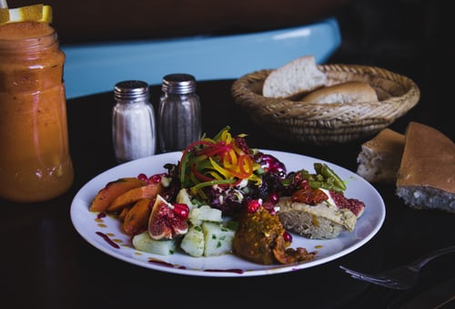
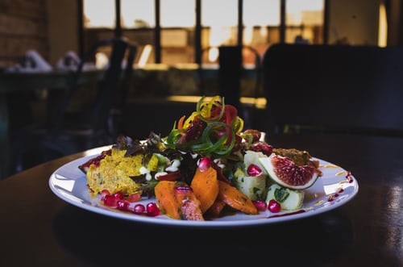

<!-- this is may this -->
i whant to ceart nav

<!-- 

    *{
    box-sizing: border-box;
    margin: 0;
    padding: 0;
    list-style: none;
    text-decoration: none;
}
body{
    height: 800vh;
}
.container{
    width: 1000px;
    margin: auto;
}
header{
    background: #FF8C00;
    height: 10vh;
}

header nav{
    text-align: center;
    background: #000;
    max-height: 10vh;
}
header ul{
    max-height: 10vh;
    display: flex;
    justify-content: center;
    align-self: center;
    background: #f00;

}

header ul li{
    padding-top: 1rem;
    margin-left: 3rem;

}

header ul li a{
    color: #fff;
    background-size: cover;
}

header img{
    width: 7%;
    border-radius: 50%;
    float: left;
    margin-left: 2rem;
}

/* main{
    width: 100%;
} */
main {
    position: relative;
    background-image: url(../images/photo-1428515613728-6b4607e44363.jpg);
    background-size: cover;
    background-attachment: fixed;
    width: 100%;
    height: 90vh;
}
main::after{
    top: 0;
    left: 0;
    bottom: 0;
    right: 0;
    position: absolute;
    background:#2e1a029d ;
    content: '';
}

/* Start minyo */
.minyo{
    text-align: center;
    padding: 2rem 0;
}
.minyo-info{
    font-size: 2rem;
    color: #FF8C00;
    text-transform: uppercase;
    margin-bottom: .5rem;
}

.minyo span{
    display: block;
    width: 100px;
    height: 2px;
    margin: auto;
    background: #2C3E50;
    transition: width 1s ease-in-out;
}
.minyo:hover span{
    width: 150px;
}

/* End minyo */

/* Start Catigory */
.cati{
    display: grid;
    grid-template-columns: auto auto auto auto;
    /* grid-gap: .3rem; */
}
.catiImg img{
    width: 24%;
    border: 1px solid #000;
    border-radius: 20px;
    padding: .4rem;
    margin-left: .4rem;
}
.more{
    width: 190px;
    border: 0;
    padding: .7rem 0;
    border-radius: 30px;
    color: #fff;
    background: #ff8c00a6;
    display: flex;
    margin: 2rem auto;
    justify-content: center;
    font-size: 1.7rem;
    cursor: pointer;
    transition: all .7s ease-in-out;
}
.more:hover{
    color: #6E6E6D;
    background: orange;
}

/* End Catigory */

 -->

 <!-- End Main -->
    
    <!-- Start Minyo -->
        

            
the best  PIZZA

            
        

    <!-- End Minyo -->
    
    <!-- Start Catigory -->
    

        

            

                
                
                
                
            

        

        <button class="more">More ...</button>
    

    <!-- End Catigory -->

